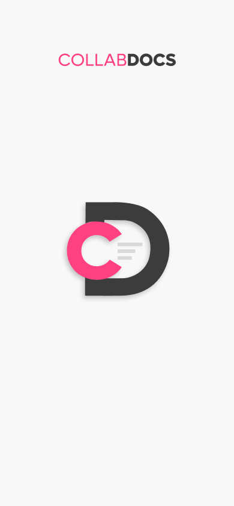
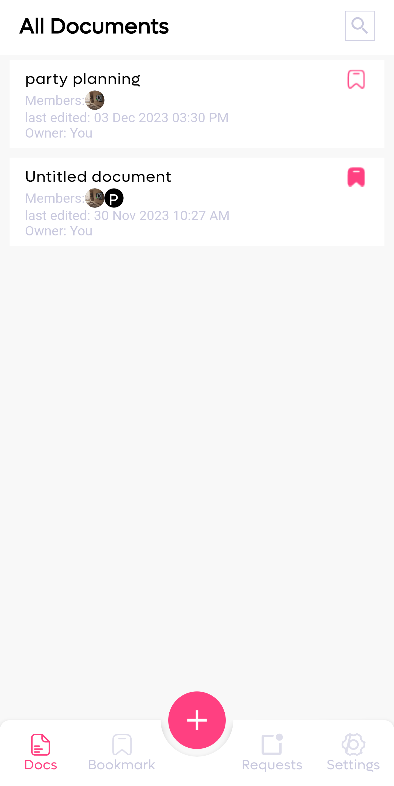
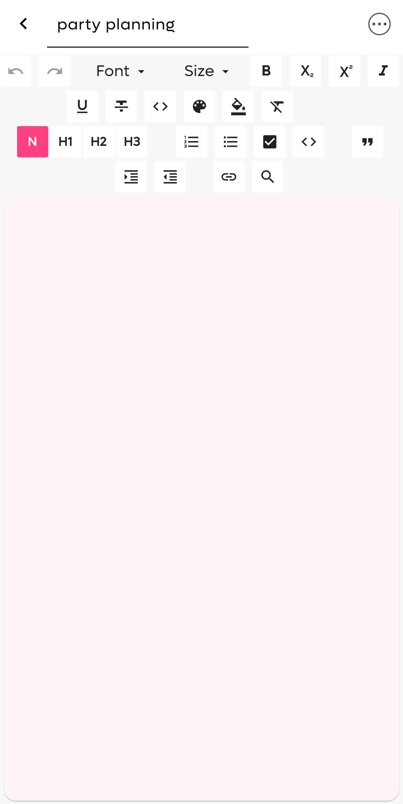
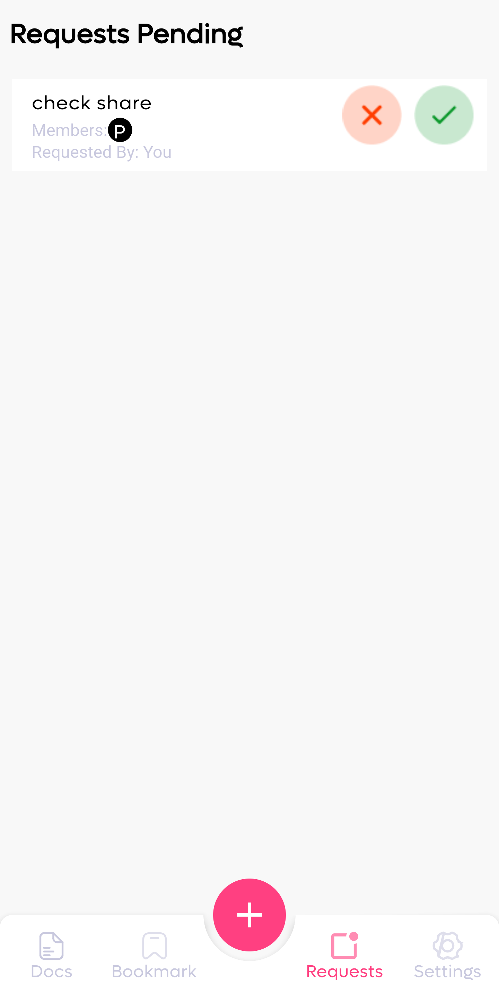
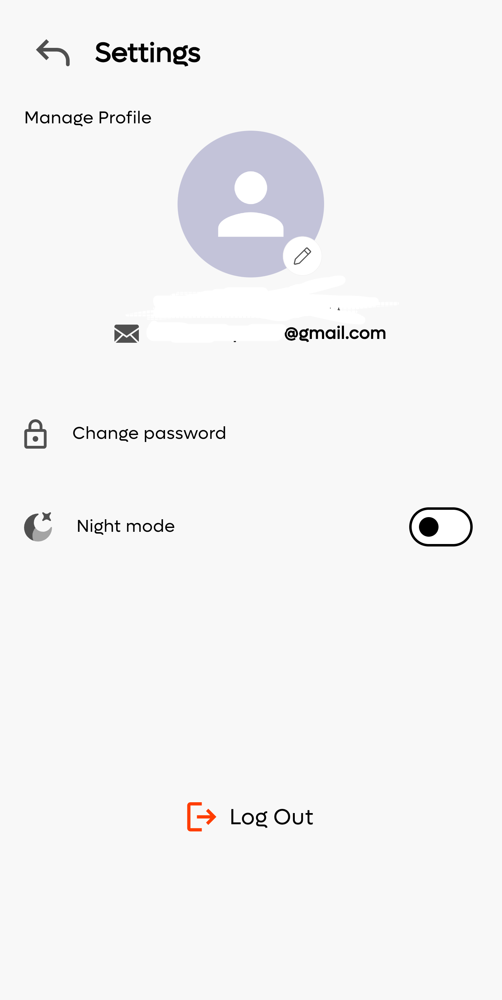

# Collab Docs

🚀 Exciting News: Introducing Collab Docs Version 1.0! 🚀

## Getting Started

Key Features:

Effortless Creation: Enjoy a streamlined document creation process with an intuitive interface for users of all levels.

Seamless Sharing: Easily share your documents, fostering collaboration among teams, friends, and clients.

Secure Cloud Storage: Ensure the safety of your documents with our secure cloud storage solution.

## Screenshots

  
  
  
  
  

## Dark Theme
Collab Docs not only offers powerful collaboration tools but also understands the importance of a personalized user experience. With our Dark Theme feature, you can now choose a sleek and stylish dark color scheme, perfect for reducing eye strain during late-night work sessions or simply adding a touch of sophistication to your workspace.
